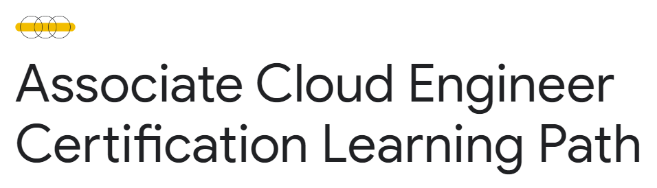
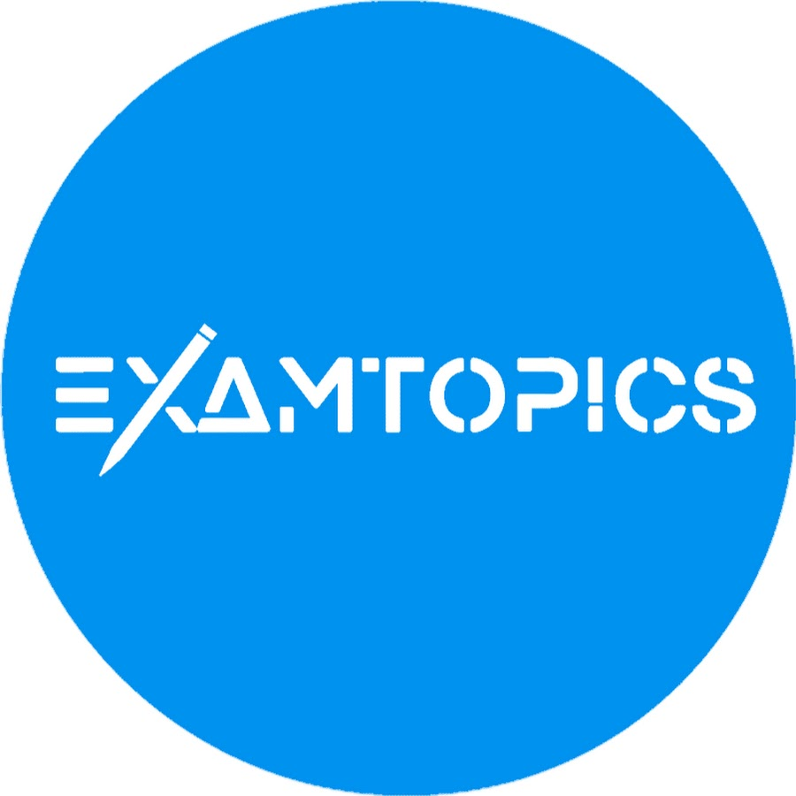

# Nuestro camino al Google Cloud Associate Cloud Engineer (GCP ACE)

<!--    -->


By: [Adrián Pascual Gómez](https://www.linkedin.com/in/adrian-pascual-gomez/)  y [Ana García Galindo](https://www.linkedin.com/in/ana-garc%C3%ADa-galindo-26b683211/)  

___________________________________________

## Preámbulo, ¡Crea tu cuenta de Google

Bluetab es Partner de GCP y si te creas una cuenta partner de GCP accedes a muchas venatajas que consideramos cruciales a la hora de estudiar y prepararse cualquier certificación emitida por Google.

[Link para registrarse](https://inthecloud.withgoogle.com/partner-training/request-training-resources.html)

Datos que debemos rellenar:

- First name
- Last name
- Company name :arrow_right: Bluetab Solutions
- Corporate email address :arrow_right: <example@bluetab.net>
- Job title
- Country
- Explore the certification learning paths :arrow_right: Associate Cloud Engineer **

** No os preocupeis luego vais a tener acceso a todos los cursos si os apetece hacer alguno distinto.

Después completar tus datos con el correo electrónico de la empresa, por lo general se lo suelen tomar con calma 1/2 semanas mínimo de espera, recibirás un correo electrónico que puede ser clasificado como spam. En ese caso, es necesario reportarlo como no spam y marcarlo como "confiable". En el peor de los casos, es posible que el correo aparezca  corrupto una vez sacado de spam, lo que requeriría que envíes nuevamente la solicitud. Esto se debe a que el correo electrónico de la empresa tiene una configuración de seguridad estricta que puede resultar inconveniente.

## ¿Qué es GCP ACE Certificate y por qué debería sacármelo?

GCP ACE (Google Cloud Certified - Associate Cloud Engineer) es muy recomendable si te apasiona el mundo de la computación en la nube y te gustaría demostrar tus habilidades.

Estas son algunas razones por las que deberías considerar obtener el certificado GCP ACE:

1. **Validación de habilidades:** Este certificado confirma tus conocimientos y competencias para trabajar de manera efectiva con Google Cloud Platform (GCP). Te convertirás en un profesional calificado y confiable en el campo de la nube

2. **Amplía tus horizontes laborales:** La demanda de expertos en la nube está en constante crecimiento. Obtener el certificado GCP ACE te abrirá puertas a nuevas oportunidades laborales en roles de ingeniería de nube o en empresas que utilizan GCP para sus operaciones.

3. **Refuerza tu perfil profesional:** Al obtener esta certificación, demuestras tu dedicación al aprendizaje continuo y al desarrollo de tus habilidades. Esto aumentará tu credibilidad ante empleadores, colegas y clientes potenciales.

4. **Acceso exclusivo a recursos:** Como titular del certificado GCP ACE, tendrás acceso a una comunidad de profesionales de Google Cloud y a recursos exclusivos, como eventos, webinars y material adicional de estudio. Mantén tu conocimiento actualizado y sigue creciendo en tu carrera.

5. **Mejora tus habilidades:** El proceso de preparación para el examen de certificación te permitirá profundizar tus conocimientos sobre los servicios y características de Google Cloud, así como aprender las mejores prácticas en la implementación y gestión de infraestructuras en la nube.

En resumen, el certificado GCP ACE te ayudará a destacar en el campo de la computación en la nube, abrirá nuevas oportunidades laborales y te permitirá mejorar tus habilidades profesionales. Si sueñas con trabajar con Google Cloud Platform y deseas validar tus conocimientos, ¡no puedes perder la oportunidad de obtener esta certificación!

## Cómo es el examen

Es un tipo test de 50 preguntas. Tendrás 120 minutos para responder y necesitas tener como mínimo el 80% bien.

La mayoría de los enunciados son bastante largos, ya que son escenarios posibles que puedes encontrarte en el día a día a los que tendrías que elegir un recurso de GCP para solucionarlo.

Se supone que GCP pone algunas preguntas nuevas dificilillas. Esto quiere decir que si de pronto te encuentras con una pregunta que te parece rara o excesivamente difícil no te apures, GCP luego hace una revisión del examen y dependiendo de tu respuesta es posible que te la den por buena. Lo normal es que haya un par de respuestas válidas y esto de pie a discusión.

## Recursos

El examen lo hemos hecho en inglés, por lo que todos los recursos son puramente en inglés. Es algo a tener en cuenta, la barrera del idioma.

| Recurso           | enlace    |  Importancia        |
| :---------------: | :-------: | :-----------------: |
|   Exam Topics       |  <https://www.examtopics.com/exams/google/associate-cloud-engineer/>    | Crítico |
| _Associate Cloud Engineer Certification Learning Path_    |   <https://www.cloudskillsboost.google/journeys/69>  | Crítico |
| #993 en Nova _GCP Associate Cloud Engineer - Google Cloud Certification_ |  <https://www.udemy.com/course/google-cloud-certification-associate-cloud-engineer/>   | Altamente Recomendable |
|  #1113 en Nova  _Google Cloud Associate Cloud Engineer Practice Tests_     |   <https://www.udemy.com/course/google-cloud-associate-cloud-engineer-practice-examspractice-exams/>   | Recomendable |
|_awesome_ GitHub |<https://github.com/sathishvj/awesome-gcp-certifications/blob/master/associate-cloud-engineer.md>| Opcional |
| The Cloud Girl blog | <https://thecloudgirl.dev/sketchnote.html> | Opcional |

### Associate Cloud Engineer Certification Learning Path



En este maravilloso Learning Path de una duración estimada por Google de unas 500 horas más o menos (luego sabemos que son más) lo ves todo. Es sin duda alguna donde tenéis que centrar la energía a la hora de estudiar, ya que es propia de GCP y va a estar siempre validada y actualizada.

Se puede hacer de forma gratuita, pero recomendamos hacerte la cuenta de partner y suscribirte a este Learning Path desde ella, ya que accederas a todos los Qwiklabs gratis.

¿Y qué son los Qwiklabs? Son los laboratorios que ofrece GCP para trabajar con su tecnología en forma de pequeños labs donde te otorgan un sandbox para que practiques y aprendas. Es sin duda lo que hace que este curso sea tan valioso, el hecho de que como mejor se aprende es trabajando en ello. Aún así hay unos pequeños detalles que hay que tener en cuenta.  

- Los laboratorios tienen un máximo de 5 repeticiones por cada uno.
- Si no haces lo especificado por el lab, GCP puede bannear tu cuenta por hacer un uso "indebido".
- Cuando te enfrentes a los últimos labs, que son las "quests"... no le des a validar nada hasta que no hayas terminado la quest por completo. Van un poco mal en ese sentido los labs, pero si lo haces todo y luego validas funcionara. Puede que ahora esto te suene raro pero, créelo, te acordarás de nosotros.
- Las quests están solucionadas por lo largo y ancho de internet, si te quedas bloqueado puedes intentar ver un video de Youtube donde la resuelvan. Esto viene bien por lo de la limitación de cinco intentos, pero recomendamos pelearte primero con la herramienta.
- Si tienes algún problema hay un chat de support. Es horrible, hay cola siempre y tardan un montón, pero te solucionan prácticamente todo. También te recargan presupuesto/intentos para los labs.

### Exam Topics



Exam Topics es maravilloso a la hora de prepararte el examen, pero hay que tener ciertos detalles en cuenta a la hora de estudiar a través de las preguntas.

1. **Haz siempre caso a la respuesta más votada de la comunidad.**  Normalmente las respuestas son explicadas a través de comentarios de la comunidad en el que la gente deja enlaces de referencia dando una explicación.

2. **Hay veces que ni la comunidad se aclara.** En muchas preguntas os podéis encontrar que la comunidad ha votado de manera igualada y no llegan a un acuerdo. En estos casos toca bucear por la documentación de Google, a la que os deberías acostumbrar como sitio de referencia.

3. **Exam Topics tiene un límmite de pago, pero no estamos dispuestos a pagarlo.** Exam Topics te permite unas 90-100 preguntas de manera completamente gratutita (aunque acosándote un poco con la verificación de que no eres un bot), pero si buscas la pregunta concreta puedes acceder a ella. Para ello estudiaréis con la página [quizlet.com](https://quizlet.com/545736490/flashcards ) y copiaréis y pegaréis las preguntas en el navegador. El primer enlace de la búsqueda será de Exam Topics.  

4. **Lo que hoy vale, mañana no sirve para nada.** GCP es una plataforma en constante y exponencial crecimiento, haciendo que de una semana a otra las reglas del juego cambien. En Exam Topics nos hemos encontrado con muchas respuestas bastante desactualizadas (como la tecnología StackDriver que ahora es Cloud Monitoring y funcionan distinto), por lo que ante todo siempre hay que comprobar con la documentación oficial y actualizada de Google.

### Quizlet

En el apartado anterior os hemos dejado un enlace de referencia ([quizlet.com](https://quizlet.com/545736490/flashcards )) pero que esto no os impida buscar otro más actualizado y con más preguntas; la clave está en que las preguntas vengan de Exam Topics para poder corroborarlas con la Comunida.

Esto debe valer para más certificaciones. Lo mismo con Exam Topic. Por lo que si no lo has tenido en cuenta y ya te has enfrentado a una certificación, te lo recomendamos. Hace la vida mucho más fácil.

### Nuestros propios apuntes

Os dejamos un enlace de nuestros apuntes propios. No se recomienda mucho porque alomejor para cuando estés leyendo esto todo lo de esos apuntes o gran parte está muy desactualizado. De todas formas, todo esto lo hemoss sacado del Learning Path de Google.  Está completamente en Inglés.

- [Carpeta de Recursos Compartidos](https://drive.google.com/drive/folders/1wHPtrt1zE6sNOFF-NciBCaVZ7Ov1_EM3?usp=sharing )

## Sobre el examen en sí

- Paso número 1 a seguir (INFALIBLE) si te encuentras una pregunta de examen y no sabes que respuesta escoger, si pone **Big Query** probablemente esa será la respuesta correcta.

- Paso a seguir cuando pregunten por algo relacionado con el pricing, la respuesta siempre es **Pricing Calculator**

- Tener en cuenta siempre que a veces hay varias respuestas que son "_correctas_" pero GCP dará por buenas las que siguen las buenas prácticas. Esto pasa sobretodo con las de IAM.

- Hay que estudiarse la guia de comandos, aunque te digan que saber hacerlo por console es suficiente, en el examen te hacen preguntas de código; GCP quiere que sepas utilizar su CLI de manera obligatoria.  

- Los comando de la CLI suelen estar estructurados de la siguiente manera:

```console
gcloud [grupo grande de la nube] [subgrupo más específico] [acción] [flags adicionales]
```

- Hay un pequeño truco que es pensar en que google repite las cosas de más, es decir por lo general si piensas que algo es redundante esa suele ser la respuesta correcta. Lo llamamos _"la mama de la mama de la mama de la mama de la mama"_ (jajaja). Un ejemplo de esto mismo es:

```console
gcloud config configurations activate [configuration name]

```
